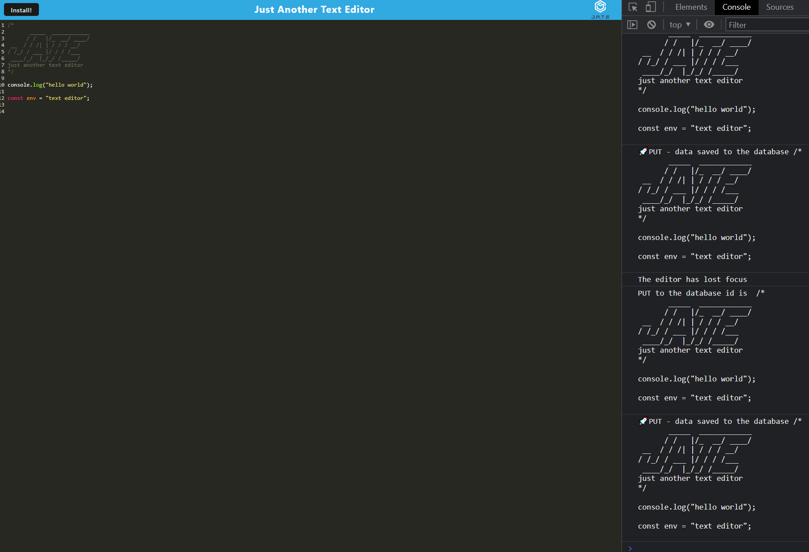
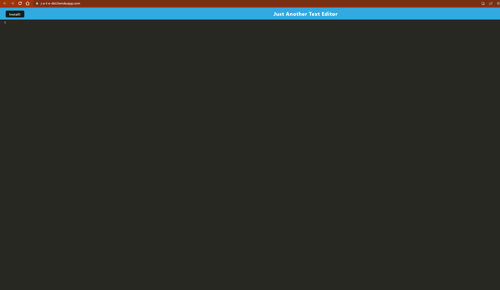

# PWA-TextEditor
This is a progressive web app that functions like a text editor. The session is saved to a database everytime the page is out of focus, and is laoded into the app every time page reloads. User can also choose to install the app for it to function without internet connection.
## Link
Checkout the deployed [Heroku app](https://j-a-t-e-dist.herokuapp.com/).
## Screenshots

